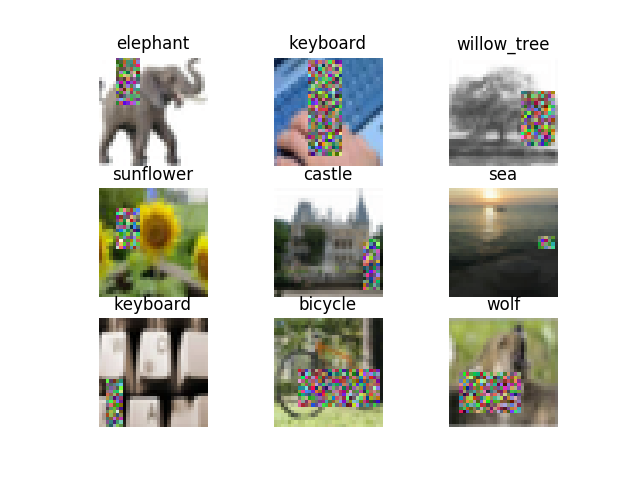
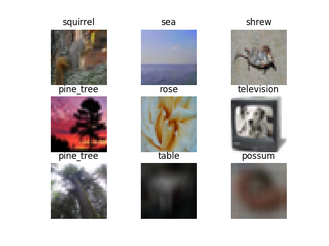
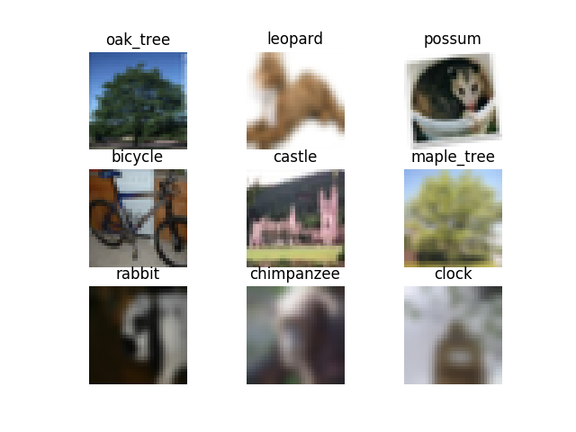
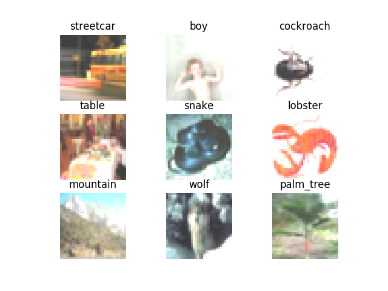

# AutomatedTesting2020

姓名：程荣鑫

学号：181250021

选题方向：AI自动化测试大作业

Data Augmentation

***

## 引言

数据增强是一个非常有意思的课题，因为就像无数前辈告诉我的那样：这个任务没有特定的准则，没有所谓的最佳实践，这是一门艺术。

在本次作业中，我尽量努力去理解这门艺术。

我使用了Mnist和Cifar100数据集，对每个数据集实现/调用一系列扩增方法（也可以叫策略），然后将这些扩增方法以我自己的准则聚合起来（或组合使用，或随机选一），生成扩增方案。

即：扩增方案 = Compose｜Oneof （扩增策略1，扩增策略2，扩增策略3）

我认为单独使用某种扩增策略有些苍白无力（灌水嫌疑），所以选择了这样的方式，那么请继续往下看，正文开始。

## 数据集简介

### Mnist数据集

经典的手写数字（0～9）图像数据集，图像均为28*28像素灰度图。训练集有60000张图片，测试集10000张。

### Cifar100数据集

Cifar100数据集有60000张32*32彩色图像，有100个类，每个类包含600个图像，其中500个训练图像，100个测试图像。CIFAR-100中的100个类被分成20个超类。每个图像都带有一个“精细”标签（它所属的类）和一个“粗糙”标签（它所属的超类）。

| Superclass                     | Classes                                               |
| ------------------------------ | ----------------------------------------------------- |
| aquatic                        | mammals beaver, dolphin, otter, seal, whale           |
| fish                           | aquarium fish, flatfish, ray, shark, trout            |
| flowers                        | orchids, poppies, roses, sunflowers, tulips           |
| food                           | containers bottles, bowls, cans, cups, plates         |
| fruit and vegetables           | apples, mushrooms, oranges, pears, sweet peppers      |
| household electrical devices   | clock, computer keyboard, lamp, telephone, television |
| household                      | furniture bed, chair, couch, table, wardrobe          |
| insects                        | bee, beetle, butterfly, caterpillar, cockroach        |
| large                          | carnivores bear, leopard, lion, tiger, wolf           |
| large man-made outdoor things  | bridge, castle, house, road, skyscraper               |
| large natural outdoor scenes   | cloud, forest, mountain, plain, sea                   |
| large omnivores and herbivores | camel, cattle, chimpanzee, elephant, kangaroo         |
| medium-sized mammals           | fox, porcupine, possum, raccoon, skunk                |
| non-insect invertebrates       | crab, lobster, snail, spider, worm                    |
| people                         | baby, boy, girl, man, woman                           |
| reptiles                       | crocodile, dinosaur, lizard, snake, turtle            |
| small mammals                  | hamster, mouse, rabbit, shrew, squirrel               |
| trees                          | maple, oak, palm, pine, willow                        |
| vehicles 1                     | bicycle, bus, motorcycle, pickup truck, train         |
| vehicles 2                     | lawn-mower, rocket, streetcar, tank, tractor          |

## 模型分析

不同的模型要求的输入不同，训练程度不同，测试效果自然也不相同，下面陈述每个数据集所提供模型的相关信息。

### Mnist数据集

|模型名称|模型输入格式|源数据测试Accuracy|
|:---:|:---:|:---:|
|dnn_with_dropout|[..., 784]|0.9805|
|dnn_without_dropout|[..., 784]|0.9743|
|lenet5_with_dropout|[..., 28, 28, 1]| 0.9872|
|lenet5_without_dropout|[..., 28, 28, 1]|0.9878|
|random1_mnist|[..., 28, 28]|0.1461|
|random2_mnist|[..., 28, 28, 1]|0.3500|
|vgg16_with_dropout|[..., 28, 28, 1]|0.9889|
|vgg16_without_dropout|[..., 28, 28, 1]|0.9862|

根据model.summary()的结果，各个网络的分析结果如下：

Dropout是一种正则化的技巧，在训练中随机使某些神经元失活，降低对某些参数的依赖，从而提高模型的泛化能力。对上面所有网络而言，with_dropout意味着更强的泛化能力。

1. DNN

   7层神经网络，总共1,503,530个可训练参数，相比LeNet更深，又没有VGG16那样吃算力，是一个比较理想的再训练目标。

2. LeNet5

   5层神经网络，总共44,426个可训练参数，是一个经典的神经网络，虽然层数少，但是就准确度而言很不错。

3. random1&random2

   顾名思义，随机神经网络，效果不会好，必然是欠拟合的模型。random2比random1多加了两层激活层，使得模型对变化更加敏感，因此性能比random1更好，但相比其他模型还是不理想。

4. VGG16

   这是mnist数据集中使用的深度最深的神经网络，参数量也是一骑绝尘：28,619,466，训练时间必然是最长的，但是相应的：性能是最好的。

### Cifar100数据集

|        模型名称        |  源数据测试Accuracy |
| :--------------------: |:----------------: |
|    CNN_with_dropout    |     0.3825       |
|  CNN_without_dropout   |      0.3733       |
|       ResNet_v1        |     0.3617       |
|       ResNet_v2        |      0.4303      |
|  lenet5_with_dropout   |     0.3885       |
| lenet5_without_dropout |      0.3560       |
|    random1    |       0.4365       |
|    random2    |       0.2996       |

1. CNN

   卷积神经网络， 1,297,028参数

2. ResNet

   ResNet_v1: 280,292个参数，其中278,916个可训练，v2有872,132个参数，其中866,916个可训练。这两个神经网络都非常深，同时依靠残差学习的机制，性能提升了一级。

3. LeNet5

   3,748,356参数，4个隐藏层

4. Random

   这两个Random网络出人意料的深，参数也非常多，难怪在测试时他们的准确度高，看来是经过不少训练的

## 项目实践

### 项目结构

1. Data

   Data中存放本次使用的数据集，最开始我使用pytorch读取，后来改为使用keras读取，因此这个文件夹成为了摆设。

2. Demo

   Demo存放扩增结果示意图，和视频流程演示。

3. Project

   项目的主要代码都在Project中。需要注意的是，deprecated子目录下的代码是不被调用的废弃代码，可以理解为草稿。

4. Models

   顾名思义，存放相应数据集的模型。所有模型的summary都被保存在本地，方便查看模型。

### 运行步骤


首先，导入模型，使用源测试数据的测试。这部分代码放在Python Package的init.py文件中，因此会在导入包时自动调入。

```python
model_path = os.path.join(root, m)
model = keras.models.load_model(model_path)
model.compile(optimizer=o, loss=l, metrics=['accuracy'])
score = model.evaluate(x=x_test, y=y_test, verbose=1)
print('model:', m)
print('optimizer:', o, '\n', 'loss:', l)
print('Origin')
print('Loss:', score[0])
print('Accuracy:', score[1])
```

随后，使用自己构建的ImageDataset类创建数据集（内部封装了数据扩增接口），使用不同策略进行扩增（设计模式：策略模式），为了复用，第一次扩增时将数据保存为.npy格式（封装在ImageDataset.save()中），以后需要使用只要读入即可。

至于具体的策略，可以查看代码（Projects/[dataset]/strategies），文末附上具体策略表。

```python
for idx, s in enumerate(strategy):
    path = os.path.join('data', '{}/'.format(idx))
    files = sorted(os.listdir(path))
    if len(files):
        print('从已有数据集中抽取...')
        x_test = np.load(os.path.join(path, files[0]))
        y_test = np.load(os.path.join(path, files[1]))
        print('读取成功！')
        score = model.evaluate(x=x_test, y=y_test, verbose=1)
    else:
        data = ImageDataset(train_data=dataset[0], test_data=dataset[1])
        print('开始新一轮扩增...')
        data.preprocess(s)
        data.save(path, train=False)  # 存下test数据集的扩增效果
        print('新的测试数据生成成功！使用策略:', idx)
        score = model.evaluate(x=data.test_images, y=data.test_labels, verbose=1)
    print('Strategy{}'.format(idx))
    print('Loss:', score[0])
    print('Accuracy:', score[1])
```

**总而言之：到Project文件夹下找到指定数据集的目录，运行相应目录下的eval.py文件即可同时查看源数据和扩增数据的测试效果。**

### 相关参考文献


#### Mnist

1. WONG, Sebastien C., et al. Understanding data augmentation for classification: when to warp?. In: 2016 international conference on digital image computing: techniques and applications (DICTA). IEEE, 2016. p. 1-6.

    **SMOTE&Data Wrapping**

2. WANG, Jason, et al. The effectiveness of data augmentation in image classification using deep learning. Convolutional Neural Networks Vis. Recognit, 2017, 11.

3. http://www.ruanyifeng.com/blog/2012/11/gaussian_blur.html

    **高斯模糊**


#### Cifar100

1. ZHONG, Zhun, et al. Random Erasing Data Augmentation. In: AAAI. 2020. p. 13001-13008.

    **Random Erasing, 随机擦除**
    
2. KRIZHEVSKY, Alex; SUTSKEVER, Ilya; HINTON, Geoffrey E. Imagenet classification with deep convolutional neural networks. Communications of the ACM, 2017, 60.6: 84-90.()

    **Random Cropping, 随机裁减**
    
3. SIMONYAN, Karen; ZISSERMAN, Andrew. Very deep convolutional networks for large-scale image recognition. arXiv preprint arXiv:1409.1556, 2014.

    **Random Flipping, 随机翻转**
    
4. SRIVASTAVA, Nitish, et al. Dropout: a simple way to prevent neural networks from overfitting. The journal of machine learning research, 2014, 15.1: 1929-1958.

    **Random Dropout, 随机失活**

5. IOFFE, Sergey; SZEGEDY, Christian. Batch normalization: Accelerating deep network training by reducing internal covariate shift. arXiv preprint arXiv:1502.03167, 2015.

    **Batch Normalization, 批量归一化**
    
6. SHORTEN, Connor; KHOSHGOFTAAR, Taghi M. A survey on image data augmentation for deep learning. Journal of Big Data, 2019, 6.1: 60.

7. FAWZI, Alhussein, et al. Adaptive data augmentation for image classification. In: 2016 IEEE International Conference on Image Processing (ICIP). Ieee, 2016. p. 3688-3692.

8. https://github.com/UjjwalSaxena/Automold--Road-Augmentation-Library

## 实验验证

### 扩增方案

扩增方案是挑选几个相似（或者基于某种准则适合放在一起）的扩增策略聚在一起使用的，聚合的方式有两种：**Compose和Oneof**

**Compose: 组合使用扩增策略，即对一张图片使用Compose内包含的所有方法。**

**Oneof: 随机挑选一个方法扩增图片**

#### Mnist

文献标号对应参考文献Mnist栏下内容

首先给出Mnist策略表

| 扩增策略      | 解释                        | 参考  | 实现方式 | 理由                                                         |
| ------------- | --------------------------- | ----- | -------- | ------------------------------------------------------------ |
| Wrapping      | 图像扭曲                    | 文献1 | 手动实现 | 轻微的图像扭曲模拟写字时候的歪扭字迹，能够检验模型对歪歪扭扭的数字的识别能力 |
| RandomRotate  | 仿射变化：随机旋转+随机放缩 | 无    | 手动实现 | 与图像扭曲相似的方法，不过这里旋转的角度不能太大（我设为15度），放缩的程度也不能太夸张，否则容易出格 |
| GaussNoise    | 高斯噪声                    | 课堂  | 手动实现 | 给图像添加轻微程度的高斯噪声，可以测试模型鲁棒性             |
| SaltAndPepper | 椒盐噪声                    | 课堂  | 手动实现 | 同上，只不过是不同类型的噪声                                 |
| GaussBlur     | 高斯模糊                    | 3     | 手动实现 | 能使扩增后的图像更加模糊，但是整体轮廓不变                   |
| RandomSharpen | 随机锐化                    | 无    | 调用API  | 能使扩增后的手写数字更加棱角分明                             |

接着是他们的使用方案

| 方案       | 类型    | 组成                      | 准则                         |
| ---------- | ------- | ------------------------- | ---------------------------- |
| GeoTrans   | Compose | Wrapping, RandomRotate    | 同属几何变化，可以一起使用   |
| Noiser     | Oneof   | GaussNoise, SaltAndPepper | 不同类型的噪声，使用一种即可 |
| SharpOrBlur | Oneof   | GaussBlur, RandomSharpen  | 要么模糊图像，要么锐化图像   |

##### 附：图像扭曲

图像扭曲的思路来自于论文*Understanding data augmentation for classification: when to warp?*

根据论文的思路，我们有：

$R_w$，扭曲后的像素位置

$R_o$，像素原位置

$$R_w = R_0+\alpha u$$， $\alpha$表示扭曲的强度，$u$是一个满足二维正态分布的向量，根据论文的实验结果，$\alpha$取1.2时扭曲数据的测试效果最好。

我们需要把高为h，宽为w的图像中的像素点正则化，将范围约束在$(-\alpha, \alpha)$之中，像素点的行记为i，列计为j

$x=\frac{\alpha(i-\frac{h}{2})}{\frac{h}{2}}=\frac{2 \alpha i}{h}-\alpha$

同理，$y=\frac{2 \alpha j}{w}-\alpha$

偏移量offset即为x、y对应的正态分布的概率分布函数值。

此外，还需要保持中心点不动，也就是$(\frac{i}{2}, \frac{j}{2})$时的偏移量取0，于是，上面的偏移量修改为：

$offset_x=cdf(x)-0.5 $

$offset_y = cdf(y)-0.5$

（0.5为x=0的概率分布函数值）

贴出代码：

```py
h, w = img.shape[:2]
        img_out = img.copy()
        for r in range(h):
            for c in range(w):
                offset_x = int(self.alpha *
                               (stats.norm.cdf(2 * self.alpha * r / h - self.alpha) - 0.5))
                offset_y = int(self.alpha *
                               (stats.norm.cdf(2 * self.alpha * c / w - self.alpha) - 0.5))
                if r + offset_x < h and c + offset_y < w:
                    img_out[r, c] = img[r + offset_x, c + offset_y]
                else:
                    img_out[r, c] = 255.
```

##### 附：高斯模糊

[参考资料](http://www.ruanyifeng.com/blog/2012/11/gaussian_blur.html)

简单来说，高斯模糊的原理就是中心点取周边像素点颜色和它本身的加权平均数，权重满足高斯分布，依据二维高斯函数

$Gauss(x, y) = \frac{1}{2\pi\sigma^2} e^{-(\frac{x^2+y^2}{2\sigma^2})}$

其中x, y是各点到中心点坐标的差。

中心点这么取值，那么它与周边点就更接近了，言下之意，失去了一些“个性”，所以导致整张图片变得模糊。

附上实现代码：

```python
class GaussBlur(Strategy):
    """实现参考：http://www.ruanyifeng.com/blog/2012/11/gaussian_blur.htmlzz"""

    def __init__(self, sigma, radius):
        super(GaussBlur, self).__init__()
        self.sigma = sigma
        self.radius = radius

    # 高斯函数
    def _gauss_func(self, x, y):
        m = 1 / (2 * math.pi * self.sigma * self.sigma)
        n = math.exp(-(x * x + y * y) / (2 * self.sigma * self.sigma))
        return m * n

    # 高斯核
    def _get_kernel(self):
        n = self.radius * 2 + 1
        result = np.zeros((n, n))
        for i in range(n):
            for j in range(n):
                result[i, j] = self._gauss_func(i - self.radius, j - self.radius)
        tot = result.sum()
        return result / tot

    def _filter(self, img, kernel):
        h, w = img.shape[:2]
        out = img.copy()
        for i in range(self.radius, h - self.radius):
            for j in range(self.radius, w - self.radius):
                t = img[i - self.radius:i + self.radius + 1, j - self.radius:j + self.radius + 1]
                a = np.multiply(t, kernel)
                out[i, j] = a.sum()
        return out.astype(dtype=np.uint8)

    def __call__(self, img):
        kernel = self._get_kernel()
        out = self._filter(img, kernel)
        return out
```


#### Cifar

文献标号对应参考文献Cifar栏下内容

| 扩增策略             | 解释                        | 参考文献 | 实现方式 |理由|
| -------------------- | --------------------------- | -------- | -------- | -------- |
| Normalize            | 归一化（指定均值标准差）     | 文献5    | 调用API |将图像归一化，方便后续扩增，这也是一种常用扩增方法，需要给出均值和标准差，这里取mean=[0.485, 0.456, 0.406], std=[0.229, 0.224, 0.225]，这是ImageNet数据集图像数据RGB均值和标准差，可以认为等同于自然界照片的均值、标准差|
| RandomHorizontalFlip | 随机水平翻转 | 文献3  | 调用API |水平翻转能够保留图像的全部信息，虽然不适用于mnist，但是完全适合Cifar|
| RandomCrop           | 随机裁减 | 文献2 | 调用API |随机裁减是一种常用的数据扩增方法|
| RandomErasing        | 随机擦除                | 文献1   | 手动实现 |随机擦除方法来自于文献1，经实验实验是一种效果不输随机裁减的数据增强方式，能模型对提高部分被遮盖图像的识别能力|
| RandomFog            | 雾天             | 8 | 调用API |原本用于道路数据集的扩增（猜测应该是自动驾驶领域），主要在图片中增加一些天气效果，与噪声非常像，但是噪声内容更丰富；另一方面，自然界中也有种种天气现象，因此逻辑上可用于Cifar数据集，下2同|
| RandomRain           | 雨天                  | 8      | 调用API |同|
| RandomSnow           | 雪天 | 8 | 调用API |同|
|GaussianBlur|高斯模糊|无|调用API|高斯模糊，原理已在mnist中介绍过|
|Sharpen|图像锐化|无|调用API|锐化，常规图像扩增方法|
|GaussNoise|高斯噪声|无|手动实现|高斯噪声，常用噪声方法|
|SaltAndPepper|椒盐噪声|无|手动实现|椒盐噪声，常用噪声方法|

同样，这些方法我也不是单独使用的，聚合方案如下：

| 方案        | 类型    | 组成                                                       | 准则                                                         |
| ----------- | ------- | ---------------------------------------------------------- | ------------------------------------------------------------ |
| Eraser      | Compose | Normalize, RandomHorizontalFlip, RandomCrop, RandomErasing | 同属几何变化，可以一起使用，在cifar的参考文献1中，实验证明这几种方式组合使用对模型性能的提升比单独使用更好 |
| RandWeather | Oneof   | RandomFog, RandomRain, RandomSnow                          | 随机天气，一种天气现象已经足够了                             |
| ColorTrans  | Oneof   | GaussianBlur, Sharpen                                      | 要么模糊图像，要么锐化图像                                   |
| Noiser      | One of  | GaussNoise, SaltAndPepper                                  | 使用一种噪声策略即可                                         |

##### 附：随机擦除

随机擦除来自论文 Random Erasing Data Augmentation，是发表在AAAI的优秀论文。我详细的阅读了随机擦除的算法：

随机生成指定范围内的擦除区域面积（erase_area, $S_e$）、擦除区域高宽比（aspect_ratio, ar）

于是有:

擦除区域高$h=\sqrt{S_e*ar}$

擦除区域宽$w=\sqrt{\frac{S_e}{ar}}$

需要满足h1）

1. 准确率，accuracy，更准确来说，keras.metrics.sparse_categorical_accuracy

   categorical_accuracy和accuracy很像。不同的是accuracy针对的是y_true和y_pred都为具体标签的情况，而categorical_accuracy针对的是y_true为onehot标签，y_pred为向量的情况；但是我们的标签集非onehot形式，因此需要使用sparse_categorical_accuracy

2. keras.metrics.sparse_top_k_categorical_accuracy

   在准确率的基础上引入“TopK”的概念，我个人倾向于将K理解为“宽容度”，categorical_accuracy要求样本在真值类别上的预测分数是在所有类别上预测分数的最大值，才算预测对，而top_k_categorical_accuracy只要求样本在真值类别上的预测分数排在其在所有类别上的预测分数的前k名就行，是一种更加宽松的准确率指标

   在实验中，**k=2**，因此叫Top2准确率

   ```python
   def top2Accu(y_true, y_pred):
       return keras.metrics.sparse_top_k_categorical_accuracy(y_true, y_pred, 2)  # k=2
   ```

3. keras.metrics.sparse_categorical_crossentropy，交叉熵

   计算标签集和预测结果集之间的差异程度，这个值越小越好；使用sparse的原因同上面两个一样。

   这里给出计算公式
   $$
   CE(p, q)=-\sum_{i=1} ^c pi*\log{qi}
   $$
   其中c表示类别数，例如对一个样本，$p=[0, 1, 0], q=[0.3, 0.6, 0.1], p_0=p_2=0, p1=1, q_0=0.3, q_1=0.6, q_2=0.1$

   对样本集，计算交叉熵的算术均值作为集合交叉熵。

### 验证结果

**说明：在以下所有数据中，标签集均相同，图片集是同等规模的，源自同一批图片，使用不同方案扩增，为了保证扩增不失真，我的参数设计的相对保守。**

#### Mnist

##### 源数据

| 模型                   | 准确率 | Top2准确率 | 交叉熵  |
| ---------------------- | ------ | ---------- | ------- |
| dnn_with_dropout       | 0.9805 | 0.9994     | 11.7609 |
| dnn_without_dropout    | 0.9743 | 0.9991     | 23.3340 |
| lenet5_with_dropout    | 0.9872 | 0.9998     | 7.0719  |
| lenet5_without_dropout | 0.9878 | 0.9998     | 7.0783  |
| random1_mnist          | 0.1461 | 0.2423     | 8.9424  |
| random2_mnist          | 0.3500 | 0.5717     | 5.0643  |
| vgg16_with_dropout     | 0.9889 | 0.9999     | 14.9729 |
| vgg16_without_dropout  | 0.9862 | 1.0000     | 18.5169 |

##### 扩增方案1: GeoTrans（旋转放缩加扭曲）

| 模型                   | 准确率 | Top2准确率 | 交叉熵  |
| ---------------------- | ------ | ---------- | ------- |
| dnn_with_dropout       | 0.9793 | 0.9992     | 11.6293 |
| dnn_without_dropout    | 0.9731 | 0.9996     | 22.3690 |
| lenet5_with_dropout    | 0.9859 | 0.9997     | 6.8043  |
| lenet5_without_dropout | 0.9865 | 0.9996     | 6.8252  |
| random1_mnist          | 0.1348 | 0.2188     | 9.1705  |
| random2_mnist          | 0.3448 | 0.5755     | 4.7605  |
| vgg16_with_dropout     | 0.9874 | 0.9998     | 15.8530 |
| vgg16_without_dropout  | 0.9838 | 0.9999     | 19.9827 |


##### 扩增方案2: Noiser（高斯/椒盐噪声）

| 模型                   | 准确率 | Top2准确率 | 交叉熵  |
| ---------------------- | ------ | ---------- | ------- |
| dnn_with_dropout       | 0.9712 | 0.9992     | 16.5411 |
| dnn_without_dropout    | 0.9543 | 0.9985     | 38.2146 |
| lenet5_with_dropout    | 0.9854 | 0.9996     | 7.6784  |
| lenet5_without_dropout | 0.9870 | 0.9998     | 6.9120  |
| random1_mnist          | 0.1215 | 0.2195     | 8.5697  |
| random2_mnist          | 0.3143 | 0.5803     | 7.0469  |
| vgg16_with_dropout     | 0.9860 | 0.9999     | 18.3717 |
| vgg16_without_dropout  | 0.9842 | 0.9998     | 23.0302 |

##### 扩增方案3: SharpOrBlur（锐化/高斯模糊）

| 模型                   | 准确率 | Top2准确率 | 交叉熵  |
| ---------------------- | ------ | ---------- | ------- |
| dnn_with_dropout       | 0.9792 | 0.9996     | 12.2994 |
| dnn_without_dropout    | 0.9754 | 0.9987     | 24.4534 |
| lenet5_with_dropout    | 0.9871 | 0.9997     | 7.4333  |
| lenet5_without_dropout | 0.9878 | 0.9998     | 7.3730  |
| random1_mnist          | 0.1448 | 0.2456     | 8.5841  |
| random2_mnist          | 0.3459 | 0.5719     | 5.3849  |
| vgg16_with_dropout     | 0.9890 | 0.9998     | 15.6416 |
| vgg16_without_dropout  | 0.9864 | 1.0000     | 19.1647 |

**结论：**

**1. 从准确率角度看，我的扩增方案很好的保证了模型标签不失真（扩增集准确率与源数据测试准确率非常接近），扩增测试数据准确率略有下降，说明模型的鲁棒性有待提高**

**2. GeoTrans: 旋转+放缩+扭曲是一种不错的扩增方案，在各个模型上的表现比其他两种扩增方案更好，当然是在合理的参数下；此外，从交叉熵角度看，GeoTrans后的预测结果也是和源数据预测结果最接近的，Noiser和SharpOrBlur和源数据预测结果差别相对更大**

**3. 如果为了提高模型鲁棒性，需要扩增训练集对模型进行训练，此时可以尝试把参数调的稍微激进一些**

**4. 不难发现，使用Top2准确度准则，大多数模型都能在各个方案下得出较高的准确度，说明大多数模型离正确预测只有“一步之遥”**

#### Cifar100

##### 源数据

| 模型                   | 准确率 | Top2准确率 | 交叉熵 |
| ---------------------- | ------ | ---------- | ------ |
| CNN_with_dropout       | 0.3825 | 0.5085     | 2.4512 |
| CNN_without_dropout    | 0.3733 | 0.5065     | 3.1863 |
| ResNet_v1              | 0.3617 | 0.4853     | 5.1054 |
| ResNet_v2              | 0.4303 | 0.5545     | 4.1586 |
| lenet5_with_dropout    | 0.3885 | 0.5179     | 2.4238 |
| lenet5_without_dropout | 0.3560 | 0.4789     | 3.5416 |
| random1                | 0.4365 | 0.5772     | 2.1431 |
| random2                | 0.2996 | 0.4166     | 2.8907 |

##### 扩增方案1: Eraser（正则化+随机翻转+随机裁减+随机擦除）

| 模型                   | 准确率 | Top2准确率 | 交叉熵 |
| ---------------------- | ------ | ---------- | ------ |
| CNN_with_dropout       | 0.1802 | 0.2686     | 3.7292 |
| CNN_without_dropout    | 0.1758 | 0.2681     | 5.5978 |
| ResNet_v1              | 0.1678 | 0.2528     | 8.9106 |
| ResNet_v2              | 0.2232 | 0.3135     | 7.2847 |
| lenet5_with_dropout    | 0.2202 | 0.3175     | 3.3960 |
| lenet5_without_dropout | 0.1957 | 0.2917     | 5.6688 |
| random1                | 0.1702 | 0.2611     | 3.5914 |
| Random2                | 0.1920 | 0.2873     | 3.4212 |

##### 扩增方案2: RandWeather（随机天气：雨雪雾）

| 模型                   | 准确率 | Top2准确率 | 交叉熵 |
| ---------------------- | ------ | ---------- | ------ |
| CNN_with_dropout       | 0.3073 | 0.4116     | 3.2656 |
| CNN_without_dropout    | 0.3095 | 0.4223     | 3.9313 |
| ResNet_v1              | 0.2826 | 0.3811     | 7.5561 |
| ResNet_v2              | 0.3267 | 0.4249     | 7.4362 |
| lenet5_with_dropout    | 0.3183 | 0.4310     | 2.8801 |
| lenet5_without_dropout | 0.2980 | 0.4038     | 3.8373 |
| random1                | 0.3438 | 0.4589     | 2.9597 |
| Random2                | 0.2572 | 0.3636     | 3.2825 |

##### 扩增方案3: SharpOrBlur（锐化/模糊）

| 模型                   | 准确率 | Top2准确率 | 交叉熵  |
| ---------------------- | ------ | ---------- | ------- |
| CNN_with_dropout       | 0.2068 | 0.2883     | 4.1781  |
| CNN_without_dropout    | 0.2172 | 0.3074     | 6.0240  |
| ResNet_v1              | 0.1669 | 0.2383     | 10.6681 |
| ResNet_v2              | 0.1861 | 0.2587     | 11.0130 |
| lenet5_with_dropout    | 0.2217 | 0.3119     | 4.0577  |
| lenet5_without_dropout | 0.2193 | 0.3058     | 5.2959  |
| random1                | 0.2057 | 0.2839     | 4.2991  |
| Random2                | 0.2122 | 0.3002     | 4.5932  |

##### 扩增方案4: Noiser（高斯/椒盐噪声）

| 模型                   | 准确率 | Top2准确率 | 交叉熵 |
| ---------------------- | ------ | ---------- | ------ |
| CNN_with_dropout       | 0.3024 | 0.4056     | 3.3366 |
| CNN_without_dropout    | 0.3033 | 0.4112     | 4.0961 |
| ResNet_v1              | 0.2639 | 0.3594     | 7.8651 |
| ResNet_v2              | 0.3002 | 0.3969     | 7.7835 |
| lenet5_with_dropout    | 0.3124 | 0.4199     | 2.9567 |
| lenet5_without_dropout | 0.2890 | 0.3979     | 3.9236 |
| random1                | 0.3413 | 0.4535     | 3.0146 |
| Random2                | 0.2553 | 0.3593     | 3.3109 |

**结论：**

**1. Cifar100数据集模型准确度普遍不高，说明训练程度不够，欠拟合；同时也说明Cifar100图像内容比Mnist丰富的多，是一个更加有挑战的数据集**

**2. 在我设计的扩增方案中，擦除法是用来检验模型抗遮挡物能力的，测试准确很低，恰恰说明在这方面模型表现不佳，需要擦除训练集的训练；灵光一现的随机天气法表现不错，就如我在前文说的那样，它和噪声很像，测试准确率也和噪声法接近；锐化/模糊方法居然表现很差，有点出乎意料，可能Cifar100数据集不太适合这种方法**

**3. 综合各个模型在各个方案的表现Top2准确率，比准确率有进步，但是数值上还是不高**

**4. ResNet网络的交叉熵相比其他模型更加突出**

**5. 如果要提升模型鲁棒性，选择擦除法进行训练（毕竟来自CCF A级别论文，经论文作者实验证明有效）**

#### 模型训练尝试

如上文所述，我想尝试一下随机擦除法的训练效果，所以扩增了100000张擦除法（Cifar扩增策略1）生成的图片，使用助教提供的ResNet_v2（旧版本，即github仓库中性能较低的那一版ResNet_v2）迭代训练50轮（条件有限）。训练花费10个多小时，最终训练到Loss约为0.9，Accuracy约为87%的程度（很遗憾我一早起来往把终端日志保存下来就关了，所以这里没有截图证明，但是模型文件存在本地了）

Project/cifar/ResNet.h5

| 来源                   | 准确率 | TopK准确率 | 交叉熵 |
| ---------------------- | ------ | ---------- | ------ |
| 源数据                 | 0.5135 | 0.6551     | 3.1729 |
| 扩增方案0: Eraser      | 0.4334 | 0.5735     | 3.3937 |
| 扩增方案1: RandWeather | 0.3942 | 0.5090     | 5.3565 |
| 扩增方案2: SharpOrBlur | 0.2354 | 0.3170     | 8.0808 |
| 扩增方案4: Noiser      | 0.3900 | 0.5027     | 5.5257 |

对比上面的结果可以发现，用擦除法训练后的ResNet_v2在各个方案前都比github新版本的ResNet_v2表现好，如果继续训练下去相信会有更好的结果。

**结论：随机擦除扩增方案能有效增强模型的鲁棒性, 是一种有效的图像增强方案**

## 结果示例

### Mnist

1. 原图


2. 扩增方案1: GeoTrans（旋转放缩加扭曲）


3. 扩增方案2: Noiser（高斯/椒盐噪声）


4. 扩增方案3: SharpOrBlur（锐化/高斯模糊）


### Cifar100

strategy = [eraser, rand_weather, sharpOrBlur, noiser]

1. 原图


2. 扩增方案1: Eraser（正则化+随机翻转+随机裁减+随机擦除）



3. 扩增方案2: RandWeather（随机天气：雨雪雾）



4. 扩增方案3: SharpOrBlur（锐化/模糊）



5. 扩增方案4: Noiser（高斯/椒盐噪声）



## 个人感想

一次非常有意思的作业，切实体会了一把训练模型的感觉（虽然没有要求，哈哈），我得承认完成这一切感觉挺累的，这个作业从我打草稿开始（项目文件中的deprecated目录），前前后后大约做了两星期吧，一度让我非常焦虑，因为我不知道自己做的事和灌水的区别多大，但是最后想出聚合策略这么个想法之后压力就小很多了。

谈谈收获：对数据增强的认识更深了，对各种工具的使用更熟练了（Tensorflow一开始用真的很慢，基本是面向搜索引擎编程）。因为耐着性子看了几篇英文文献，再加上之前的综述，我觉得我这学期读的论文数量可能比我之前读的加起来还要多。

这篇报告是我工作的句号，写了大约5、6个小时，完成之后成就感十足（能赶别的ddl了哈哈哈）。

感谢你能阅读到这里！

